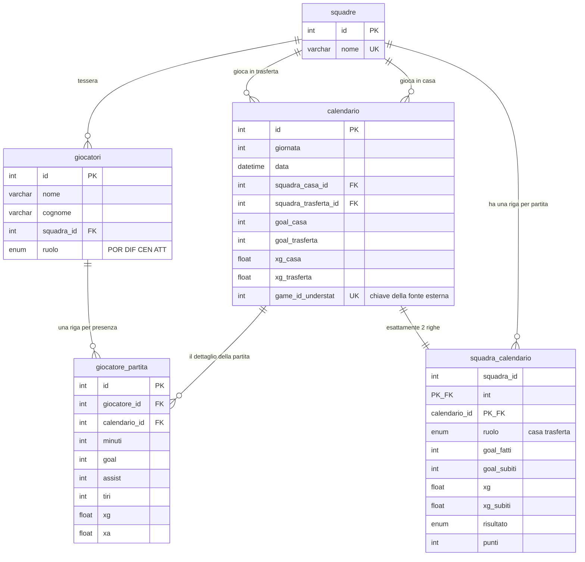

# Serie A 2025/26 — lo schema SQL

Il livello dati dietro il [Football Scout Index](https://raffaeleciccone-analyst.github.io/serie-a-index/):
schema relazionale, le nove viste che alimentano le pagine, e le query analitiche che le viste
non sanno rispondere.

**Cosa c'e' qui dentro:** SQL leggibile e commentato, non un dump da importare e basta. Sopra
ogni vista c'e' la domanda a cui risponde; sotto ogni query c'e' cosa quella query **non** dice.

| File | Cosa contiene |
|---|---|
| [`01_schema.sql`](01_schema.sql) | Le cinque tabelle, con il perche' di ogni scelta di modellazione |
| [`02_viste.sql`](02_viste.sql) | Le nove viste, una per una, con la domanda di business sopra |
| [`03_analisi.sql`](03_analisi.sql) | Sei query analitiche: funzioni finestra, CTE, self join |
| [`04_qualita_dati.sql`](04_qualita_dati.sql) | Dieci controlli di qualita': sei passano, quattro trovano difetti veri |

---

## Il modello

Uno schema a stella con **due tabelle dei fatti a grana diversa** che condividono la stessa
dimensione tempo. `calendario` e' il perno: una riga per partita, e tutto il resto ci si aggancia.



**Volumi reali:** 20 squadre · 554 giocatori · 280 partite · 560 righe squadra-partita ·
**8.772 righe giocatore-partita**.

### Tre scelte di modellazione, e perche'

**`squadra_calendario` e' denormalizzata di proposito.** La stessa informazione si ricava da
`calendario` con una UNION fra il lato casa e il lato trasferta. Sta qui perche' meta' delle
domande di questo database sono *per squadra* e non *per partita*: con la UNION ogni classifica
costerebbe due scansioni, e la classifica e' la query piu' eseguita che esista.

**`punti` e `risultato` sono materializzati** anche se derivabili dai goal. La regola dei tre
punti e' una convenzione, non un fatto: tenerla in un solo posto — la procedura di caricamento —
evita che venga riscritta in ogni query, con il rischio che una la scriva diversa.

**Un giocatore non convocato non ha una riga.** Non e' una dimenticanza: *zero minuti* e *non
convocato* sono cose diverse, e l'assenza di riga le tiene distinte mentre uno 0 le
confonderebbe. Conseguenza pratica, da sapere prima di scrivere query: `COUNT(gp.id)` conta le
presenze, non le giornate.

---

## Le domande

Le nove viste rispondono a domande descrittive — chi ha segnato, come e' finita, chi sta davanti.
Le sei query in `03_analisi.sql` provano a rispondere a domande su cui **qualcuno deve poi
decidere qualcosa**:

| Domanda | Tecnica |
|---|---|
| Chi sta segnando piu' di quanto dovrebbe, e quindi calera'? | Aggregazione, `NULLIF`, normalizzazione per 90' |
| Chi sta arrivando in forma e chi sta scivolando? | Finestra mobile `ROWS BETWEEN 4 PRECEDING AND CURRENT ROW` |
| Quali squadre stanno sopra il proprio gioco? | CTE, `RANK() OVER`, confronto fra due classifiche |
| Quanto dipende una squadra da un solo giocatore? | `SUM() OVER (PARTITION BY)` accanto a un `GROUP BY` |
| Chi rende di piu' al netto di quanto gioca? | Per-90 con soglia minima |
| Contro chi ha giocato davvero ogni squadra? | Self join su `squadra_calendario` |

La riga **«NON dice»** sotto ognuna e' la parte che di solito manca. Un numero senza il suo limite
scritto accanto verra' usato per rispondere alla domanda sbagliata: la query sulla dipendenza da
un giocatore, per dire, segnala dove guardare, non conclude che sia un difetto.

---

## Dati sporchi, dichiarati

I dieci controlli in `04_qualita_dati.sql` sono stati **eseguiti**, non solo scritti. Sei
passano e quattro no. Quei quattro segnalano **tre difetti veri**, e sono la parte piu' utile
del repository: dicono cosa a questi dati non si puo' chiedere.

**La colonna `giornata` non e' la giornata di campionato.** 280 partite distribuite su 21 valori
distinti, con 16 partite nella "giornata 1" e 22 nella "7", e squadre che compaiono due volte
nello stesso valore a una settimana di distanza. La fonte (Understat) espone le date, non il
numero di giornata: questa colonna e' una derivazione che non tiene.
*Conseguenza operativa:* ordinare per `data`, mai per `giornata`. La query 2 in `03_analisi.sql`
— una media mobile, cioe' esattamente il tipo di query che l'ordinamento sbagliato rovina in
silenzio — e' scritta cosi' per questo motivo.

**184 righe hanno un giocatore in una partita della squadra sbagliata.** Sono i trasferimenti:
l'anagrafica tiene una sola squadra per giocatore, quella attuale, mentre le partite restano
attribuite a chi le ha giocate. Non e' un errore di importazione, e' il modello che non ha lo
storico dei trasferimenti. Va saputo prima di aggregare per squadra.

**48 giocatori non hanno il ruolo.** E' il difetto peggiore dei tre, perche' non si manifesta:
spariscono in silenzio da ogni query che filtra per ruolo, senza errori e senza comparire in
nessun risultato.

Nessuno di questi tre e' stato nascosto sistemando il controllo. Un controllo di qualita' che
passa sempre e' un controllo che nessuno esegue.

---

## Verificato, non solo scritto

Tutte le query di questo repository sono state eseguite sui dati reali della stagione 2025/26 —
20 squadre, 554 giocatori, 280 partite, 8.772 righe giocatore-partita — e non solo scritte.
La verifica ha fatto emergere i tre difetti qui sopra e, nelle query 1 e 5, un errore mio:
l'alias `minuti` in `HAVING` ha lo stesso nome della colonna `gp.minuti`, e quale dei due vince
dipende dal motore: MySQL sceglie l'alias, SQLite la colonna, e la stessa query restituisce
due risultati diversi. Adesso l'aggregato e' scritto per esteso e non e' ambiguo per nessuno dei due.

---

## Far girare tutto

```bash
mysql -u utente -p -e "CREATE DATABASE serie_a CHARACTER SET utf8mb4;"
mysql -u utente -p serie_a < 01_schema.sql
mysql -u utente -p serie_a < 02_viste.sql
```

Serve **MySQL 8.0**: `03_analisi.sql` usa funzioni finestra e CTE.

I dati non sono in questo repository. Le pagine pubbliche del progetto pero' pubblicano
[il CSV completo](https://raffaeleciccone-analyst.github.io/serie-a-index/serie_a_tpi_2025-26.csv)
di tutti i giocatori qualificati con 49 colonne, e il `payload.json` del
[repo del sito](https://github.com/raffaeleciccone-analyst/serie-a-index) contiene giocatore per
giocatore ogni dimensione e punteggio: chi vuole rifare i conti puo' farlo da li'.

---

## Dove finisce questo livello e dove comincia il resto

Qui c'e' **il livello di misura**: le tabelle, le viste, i controlli. Il calcolo dell'indice
composito sta nel motore, in
[`serie-a-index-engine`](https://github.com/raffaeleciccone-analyst/serie-a-index-engine),
insieme alla suite di validazione.

Le quindici verifiche statistiche — comprese le tre che l'indice non supera — sono pubblicate
[qui](https://raffaeleciccone-analyst.github.io/serie-a-index/validazione.html).

Fonti dei dati: xG e xA da [Understat](https://understat.com), anagrafica e valori da
Transfermarkt, agganciati per identificativo e non per nome. I nomi delle colonne sono in
italiano perche' lo e' il dominio, e tradurli avrebbe aggiunto un livello di traduzione fra la
domanda e la query senza far guadagnare niente a nessuno.
